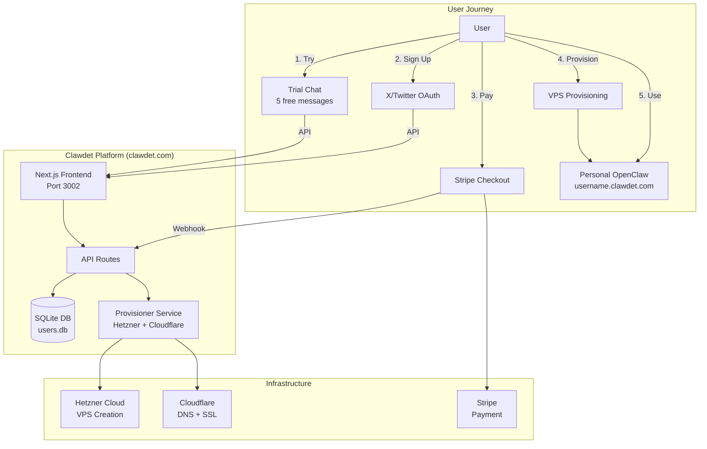
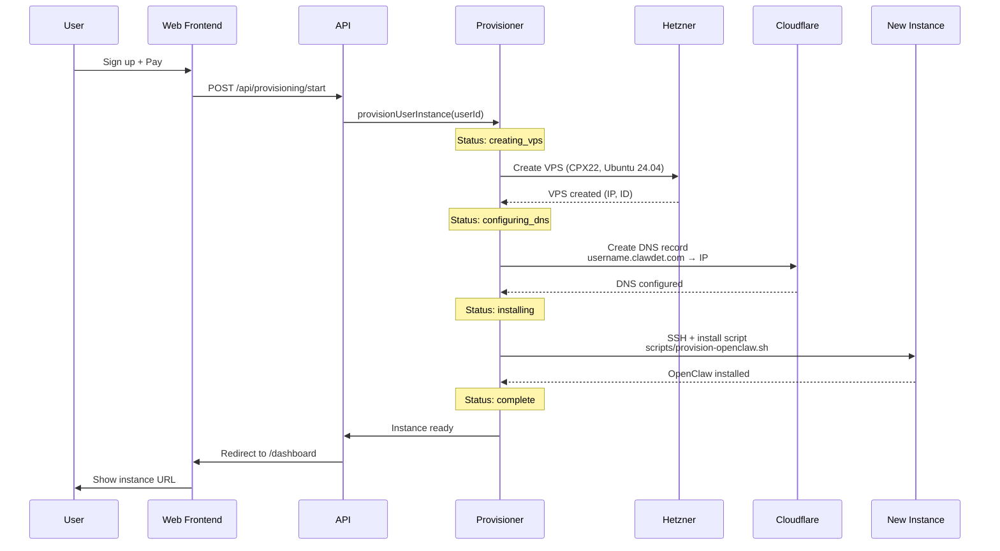
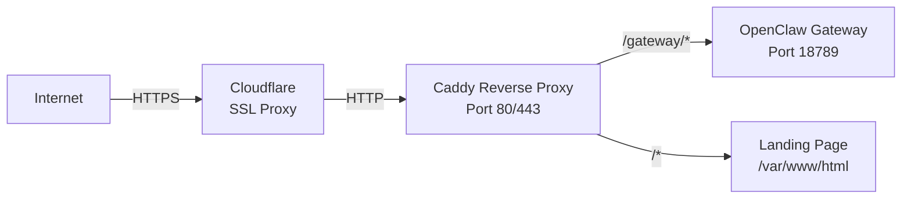

# Clawdet Platform Architecture

## Overview

Clawdet is a SaaS platform that provisions personal OpenClaw AI assistant instances for users. Each user gets their own dedicated VPS with a fully configured OpenClaw installation.

**Version:** v0.1.0-alpha (WebSocket Working!)  
**Status:** Beta-ready, needs production hardening  
**Tech Stack:** Next.js 15, React 19, SQLite, Hetzner Cloud, Cloudflare

---

## System Architecture



---

## Component Architecture

```mermaid
graph LR
    subgraph "Frontend (React/Next.js)"
        Home[Home Page<br/>Trial Chat]
        Signup[Signup Page<br/>X OAuth]
        Checkout[Checkout<br/>Stripe]
        Dashboard[Dashboard<br/>Instance Status]
    end
    
    subgraph "Backend (API Routes)"
        TrialAPI[/api/trial-chat]
        AuthAPI[/api/auth/x/*]
        ProvAPI[/api/provisioning/*]
        PayAPI[/api/payment/*]
        WebhookAPI[/api/webhooks/stripe]
    end
    
    subgraph "Services"
        ProvSvc[Provisioner V2<br/>lib/provisioner-v2.ts]
        HetznerAPI[Hetzner Client<br/>lib/hetzner.ts]
        CFAPI[Cloudflare Client<br/>lib/cloudflare.ts]
        SSHInstaller[SSH Installer<br/>lib/ssh-installer-v2.ts]
    end
    
    subgraph "Data Layer"
        UserDB[User Database<br/>lib/db.ts]
        SessionMgmt[Session Management<br/>lib/security.ts]
    end
    
    Home --> TrialAPI
    Signup --> AuthAPI
    Checkout --> PayAPI
    Dashboard --> ProvAPI
    
    TrialAPI --> UserDB
    AuthAPI --> UserDB
    PayAPI --> WebhookAPI
    ProvAPI --> ProvSvc
    
    ProvSvc --> HetznerAPI
    ProvSvc --> CFAPI
    ProvSvc --> SSHInstaller
    ProvSvc --> UserDB
```

---

## Data Flow

### User Provisioning Flow



---

## Infrastructure

### VPS Configuration (Hetzner)

**Server Type:** CPX22  
- 2 vCPU cores
- 4 GB RAM
- 80 GB SSD
- **Cost:** €5.99/month

**Location:** Auto-selected (hel1, fsn1, or nbg1)

**Image:** Ubuntu 24.04 LTS

### Installed Stack (Per Instance)

```
Ubuntu 24.04
├── Node.js 22.22.0 (LTS)
├── OpenClaw 2026.2.19-2 (latest)
├── Caddy 2.10.2 (reverse proxy + auto-SSL)
└── systemd services
    ├── openclaw-gateway (port 18789)
    └── caddy (ports 80/443)
```

### Network Architecture



### DNS Configuration

- **Main site:** clawdet.com → 188.34.197.212
- **User instances:** {username}.clawdet.com → {instance-ip}
- **SSL:** Cloudflare Universal SSL (auto-provisioned)
- **TTL:** 120 seconds (fast propagation)

---

## Security Model

### Authentication

**User Sessions:**
- Generated via `generateSessionToken()` (32-byte crypto)
- Stored in `user_session` cookie (httpOnly, secure, SameSite=strict)
- 7-day expiration

**Gateway Access:**
- Token-based: `ad0f559e3f10e173...` (stored in .env.local)
- Authorization header required for API access
- `allowInsecureAuth` enabled for web UI (development)

### Rate Limiting

Implemented in `lib/security.ts`:
- **OAuth login:** 5 requests/minute per IP
- **Trial chat:** 10 requests/minute per IP
- Storage: In-memory Map (resets on restart)

### Secrets Management

All credentials stored in `/root/.openclaw/workspace/clawdet/.env.local` (gitignored):
```
ANTHROPIC_API_KEY          # Claude AI
HETZNER_API_TOKEN          # VPS provisioning
CLOUDFLARE_API_TOKEN       # DNS management
CLOUDFLARE_ZONE_ID         # clawdet.com zone
OPENCLAW_GATEWAY_TOKEN     # Gateway auth
STRIPE_SECRET_KEY          # Payment processing
```

---

## Database Schema

**Storage:** SQLite (`lib/db.ts`)

### User Table

```typescript
interface User {
  id: string                    // Unique user ID
  xId: string                   // Twitter/X ID
  xUsername: string             // Twitter/X @handle
  xName: string                 // Display name
  xProfileImage?: string        // Avatar URL
  email?: string                // Email (collected after OAuth)
  termsAccepted?: boolean       // Terms checkbox
  paid?: boolean                // Payment status
  paidAt?: string              // Payment timestamp
  paymentMethod?: string        // 'stripe' | 'manual'
  provisioningStatus?: string   // Workflow state
  instanceUrl?: string          // username.clawdet.com
  hetznerVpsId?: string        // VPS ID for management
  hetznerVpsIp?: string        // VPS IP address
  sessionToken?: string         // Active session
  sessionCreatedAt?: number     // Session start time
  createdAt: number            // Account creation
  updatedAt: number            // Last modified
}
```

### Provisioning States

1. `pending` - Queued, not started
2. `creating_vps` - Hetzner API in progress
3. `configuring_dns` - Cloudflare DNS setup
4. `installing` - OpenClaw installation via SSH
5. `complete` - Ready to use
6. `failed` - Error occurred (check logs)

---

## Known Issues (v0.1.0-alpha)

### Critical (P0)

1. **❌ SSO OAuth Broken**
   - No `TWITTER_CLIENT_ID` configured
   - Falls back to mock mode
   - Mock creates user but redirects to /signup/details (appears stuck)
   - **Fix:** Add real Twitter OAuth credentials or improve mock flow

2. **❌ Trial Chat API Key Invalid**
   - Uses placeholder Grok API key (`placeholder_key`)
   - Returns 400: "Incorrect API key provided"
   - **Fix:** Use real Anthropic key (already have one in .env.local)

### Minor Issues

3. **⚠️ Import Paths (Fixed Today)**
   - `lib/legacy/provisioner.ts` had broken imports
   - **Fixed:** Changed `'./hetzner'` → `'../hetzner'` etc.

4. **⚠️ Missing Dependencies (Fixed Today)**
   - `stripe` package missing from package.json
   - **Fixed:** `npm install stripe`

5. **⚠️ Test Files in Build Path (Fixed Today)**
   - `test-*.ts` files breaking production build
   - **Fixed:** Moved to `.tests-backup/`

---

## Recent Fixes (Feb 20, 2026)

### Provisioning System
✅ Provisioned test-demo.clawdet.com (VPS 121594102)  
✅ Full OpenClaw installation (2026.2.19-2)  
✅ DNS + SSL via Cloudflare  
✅ Caddy reverse proxy configured  
✅ Instance live: https://test-demo.clawdet.com

### Code Fixes
✅ Fixed broken imports in `lib/legacy/provisioner.ts`  
✅ Added missing `stripe` dependency  
✅ Moved test files out of build path  
✅ Recreated `.env.local` with all credentials

### Monitoring
✅ Enhanced health check cron with gateway tests  
✅ Verifies both gateways (main + test-demo)  
✅ Token authentication verification  
✅ PM2 process monitoring

---

## Performance Characteristics

### Build Time
- Development: ~3-5 seconds (Turbopack)
- Production: ~30-45 seconds (full build)

### Provisioning Time
- VPS creation: 30-60 seconds
- DNS propagation: 0-120 seconds (Cloudflare proxied)
- OpenClaw installation: 2-3 minutes
- **Total:** 3-7 minutes (typical: 4-5 min)

### Runtime
- Next.js server: Port 3002 (PM2 managed)
- Memory usage: ~65 MB
- CPU: Minimal (<1% idle)

---

## Deployment

### Current Production
- **Host:** 188.34.197.212
- **Process Manager:** PM2
- **Proxy:** Caddy (system service)
- **Restart Policy:** PM2 auto-restart on failure

### Deploy Process
```bash
cd /root/.openclaw/workspace/clawdet
git pull
npm install
npm run build
pm2 restart clawdet-prod
```

---

## Future Improvements

### Short-term
- [ ] Fix SSO OAuth with real Twitter credentials
- [ ] Add real API keys for trial chat
- [ ] Comprehensive test suite (unit + E2E)
- [ ] Enhanced health checks with token auth
- [ ] Monitoring dashboard

### Medium-term
- [ ] CI/CD pipeline
- [ ] Automated backups
- [ ] User analytics
- [ ] Instance management dashboard
- [ ] Email notifications

### Long-term
- [ ] Multi-region support
- [ ] Auto-scaling
- [ ] Advanced instance features
- [ ] Team/enterprise plans
- [ ] API for developers

---

**Last Updated:** 2026-02-20  
**Maintainer:** Clawdet Team  
**Status:** Beta-ready, active development
