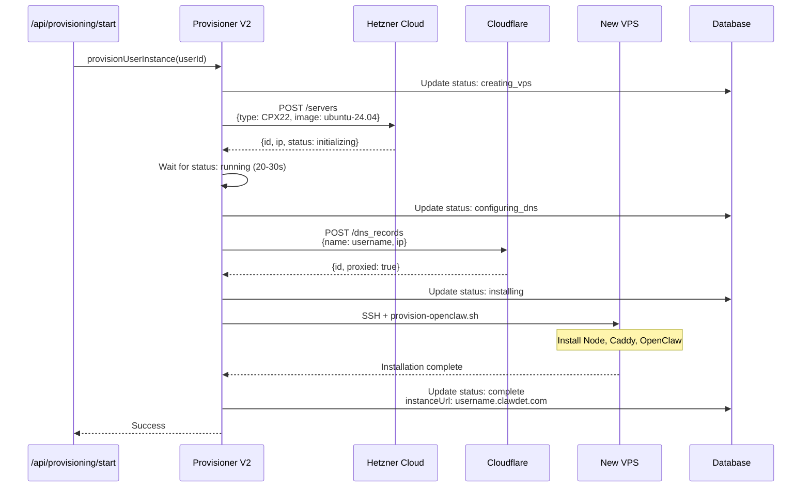

# VPS Provisioning Flow

## Overview

Automatic provisioning of personal OpenClaw instances on Hetzner Cloud VPS with Cloudflare DNS.

**Time:** 3-7 minutes (typical: 4-5 min)  
**Status:** ✅ Working (tested with test-demo.clawdet.com)

---

## Flow Diagram



---

## Implementation

**File:** `lib/provisioner-v2.ts`

**Key Functions:**
```typescript
async function provisionUserInstance(userId: string): Promise<void>
async function createServer(name: string): Promise<HetznerServer>
async function installOpenClawViaSSH(ip: string, config: Config): Promise<void>
async function createSubdomain(subdomain: string, ip: string): Promise<void>
```

**Installation Script:** `scripts/provision-openclaw.sh`
- Installs Node.js 22
- Installs Caddy 2.10+
- Installs OpenClaw (npm global)
- Configures systemd services
- Sets up workspace files

---

## Success Criteria

✅ VPS created on Hetzner  
✅ DNS record created (A record, proxied)  
✅ OpenClaw installed and running  
✅ Gateway accessible on port 18789  
✅ Landing page served via Caddy  
✅ Instance URL added to database

---

## Current Status

**Working:** ✅ Full provisioning tested successfully  
**Test Instance:** test-demo.clawdet.com (VPS 121594102)  
**Last Test:** 2026-02-20 12:35 UTC

**Documented Issues (Fixed):**
- ✅ Import paths in lib/legacy/provisioner.ts
- ✅ Missing stripe dependency
- ✅ Test files breaking build

---

## Testing

See: `tests/vps-validation.test.ts` (needs recreation after revert)

**Manual Test:**
```bash
# Provision test instance
cd /root/.openclaw/workspace/clawdet
npx ts-node -e "
  import {provisionUserInstance} from './lib/provisioner-v2'
  await provisionUserInstance('test-user-123')
"

# Validate (after 5 minutes)
ssh root@<vps-ip> "openclaw --version && systemctl is-active openclaw-gateway"
curl -I https://test-user-123.clawdet.com
```
