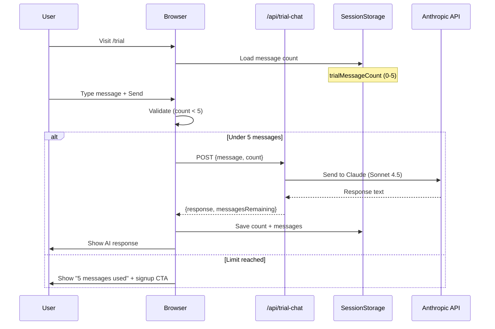

# Trial Chat Flow

## Overview

Users can try Clawdet with 5 free messages before signing up. The trial uses the Anthropic Claude API to demonstrate the AI assistant capabilities.

**Status:** ⚠️ Partially working (API key issue)  
**Location:** `/app/trial/page.tsx`  
**API:** `/app/api/trial-chat/route.ts`

---

## User Flow Diagram



---

## Step-by-Step Flow

### 1. Page Load (`/trial`)

**What happens:**
- React component mounts
- Load from `sessionStorage`:
  ```javascript
  const stored = sessionStorage.getItem('trialMessages')
  const storedCount = sessionStorage.getItem('trialMessageCount')
  ```
- Display message count: "X/5 messages remaining"

**UI Elements:**
- Welcome message: "Try Clawdet with 5 free messages"
- Chat messages area (scrollable)
- Input field + Send button
- Message counter badge

### 2. User Sends Message

**Client-side validation:**
```typescript
if (messageCount >= MAX_MESSAGES) {
  // Show limit reached modal
  return
}

if (!input.trim()) {
  // Ignore empty messages
  return
}
```

**UI Updates:**
1. Add user message to chat (blue bubble, right-aligned)
2. Disable input + button
3. Show "..." loading indicator
4. Clear input field

### 3. API Call

**Endpoint:** `POST /api/trial-chat`

**Request:**
```json
{
  "message": "Hello, are you working?",
  "count": 1
}
```

**Headers:**
```
Content-Type: application/json
```

**Rate Limiting:**
- 10 requests/minute per IP
- Tracked in-memory (resets on restart)

### 4. Backend Processing

**File:** `app/api/trial-chat/route.ts`

**Logic:**
```typescript
// 1. Validate message count
if (count >= MAX_MESSAGES) {
  return {
    limitReached: true,
    message: "Trial limit reached. Sign up for unlimited access!",
    messagesRemaining: 0
  }
}

// 2. Call Anthropic API
const response = await anthropic.messages.create({
  model: "claude-sonnet-4-5",
  max_tokens: 1024,
  messages: [{
    role: "user",
    content: message
  }]
})

// 3. Extract response text
const aiResponse = response.content[0].text

// 4. Return to client
return {
  response: aiResponse,
  messagesRemaining: MAX_MESSAGES - count,
  limitReached: false
}
```

### 5. Response Handling

**Success:**
```json
{
  "response": "I'm Clawdet, your AI assistant! I'm working perfectly. How can I help you today?",
  "messagesRemaining": 4,
  "limitReached": false
}
```

**Client Updates:**
1. Add AI response to chat (gray bubble, left-aligned)
2. Increment message count
3. Update counter badge
4. Save to sessionStorage
5. Re-enable input + button
6. Auto-scroll to latest message

**Limit Reached:**
```json
{
  "limitReached": true,
  "message": "Trial limit reached. Sign up for unlimited access!",
  "messagesRemaining": 0
}
```

**Client Updates:**
1. Show modal/message about limit
2. Display "Get Started" CTA button
3. Disable input field
4. Button redirects to `/signup`

### 6. Session Persistence

**Stored in SessionStorage:**
```javascript
{
  "trialMessages": [
    {role: "user", content: "Hello!"},
    {role: "assistant", content: "Hi! How can I help?"},
    // ...
  ],
  "trialMessageCount": 2
}
```

**Lifetime:**
- Persists until browser tab is closed
- Separate per tab (not shared across tabs)
- Cleared on browser refresh (by design - prevents abuse)

---

## Error Handling

### API Error (400/500)

**What user sees:**
```
"Sorry, something went wrong. Please try again."
```

**Logged to console:**
```javascript
console.error('Error:', error)
```

**Common errors:**
1. **Invalid API key** (current issue)
   - Anthropic returns 401/400
   - Fallback message shown
2. **Rate limit exceeded**
   - 429 response
   - "Too many requests" message
3. **Network timeout**
   - Connection error
   - "Connection error" message

### Client-side Errors

**Empty message:**
- Ignored silently
- Button stays disabled

**Offline:**
- Fetch fails
- "Connection error" shown

**SessionStorage full:**
- Rare, but possible
- Try-catch around storage calls

---

## API Endpoint Details

### Route: `/api/trial-chat`

**Method:** POST  
**Auth:** None (public)  
**Rate limit:** 10 req/min per IP

**Request Body:**
```typescript
{
  message: string,      // User's message
  count: number         // Current message count (1-5)
}
```

**Response (Success):**
```typescript
{
  response: string,           // AI response text
  messagesRemaining: number,  // 5 - count
  limitReached: boolean       // false
}
```

**Response (Limit Reached):**
```typescript
{
  limitReached: boolean,      // true
  message: string,            // CTA message
  messagesRemaining: number   // 0
}
```

**Response (Error):**
```typescript
{
  error: string               // Error message
}
// HTTP status: 400, 429, or 500
```

---

## Current Issues

### ❌ Critical: Invalid API Key

**Problem:**
```
Grok API Error: 400 {"code":"Client specified an invalid argument","error":"Incorrect API key provided: pl***ey"}
```

**Root cause:**
- `.env.local` has `GROK_API_KEY=placeholder_key`
- Trial chat uses Grok API (should use Anthropic)

**Fix:**
Option 1: Use Anthropic key (already have it)
```bash
# Edit app/api/trial-chat/route.ts
# Change from Grok to Anthropic SDK
```

Option 2: Get real Grok/xAI API key
```bash
# Update .env.local
GROK_API_KEY=real_key_from_x_ai
```

### ⚠️ Minor: No Cost Tracking

**Problem:**
- No tracking of API costs per trial user
- Could be abused (refresh = new 5 messages)

**Potential fix:**
- Track by IP address + timestamp
- Store in database or Redis
- Limit to X trials per IP per day

### ⚠️ Minor: No Analytics

**Problem:**
- Don't know conversion rate (trial → signup)
- Can't track which messages lead to signups

**Potential fix:**
- Add PostHog or similar
- Track events: `trial_message_sent`, `trial_limit_reached`, `trial_signup_clicked`

---

## Testing

### Manual Test

1. Visit https://clawdet.com/trial
2. Send message: "Hello, are you working?"
3. **Expected:** AI response within 2-3 seconds
4. **Actual (current):** Error message (API key invalid)
5. Send 4 more messages
6. **Expected:** Limit reached modal
7. Click "Get Started"
8. **Expected:** Redirect to /signup

### Unit Test (TODO)

```typescript
// tests/api/trial-chat.test.ts
describe('POST /api/trial-chat', () => {
  it('should return AI response for valid message', async () => {
    const response = await fetch('/api/trial-chat', {
      method: 'POST',
      body: JSON.stringify({ message: 'Hello', count: 1 })
    })
    const data = await response.json()
    expect(data).toHaveProperty('response')
    expect(data.messagesRemaining).toBe(4)
  })

  it('should reject when limit reached', async () => {
    const response = await fetch('/api/trial-chat', {
      method: 'POST',
      body: JSON.stringify({ message: 'Hello', count: 5 })
    })
    const data = await response.json()
    expect(data.limitReached).toBe(true)
    expect(data.messagesRemaining).toBe(0)
  })

  it('should handle rate limiting', async () => {
    // Send 11 requests rapidly
    // 11th should return 429
  })
})
```

### E2E Test (TODO)

```typescript
// tests/e2e/trial-chat.spec.ts
test('trial chat flow', async ({ page }) => {
  await page.goto('/trial')
  
  // Check welcome message
  await expect(page.locator('.welcome')).toContainText('5 free messages')
  
  // Send message
  await page.fill('input[type="text"]', 'Hello!')
  await page.click('button:has-text("Send")')
  
  // Wait for response
  await page.waitForSelector('.message.assistant')
  await expect(page.locator('.message.assistant').last()).toContainText(/working|help|Clawdet/i)
  
  // Check counter
  await expect(page.locator('.counter')).toContainText('4 messages remaining')
  
  // Send 4 more messages (total 5)
  for (let i = 0; i < 4; i++) {
    await page.fill('input[type="text"]', `Message ${i + 2}`)
    await page.click('button:has-text("Send")')
    await page.waitForSelector(`.message.assistant >> nth=${i + 1}`)
  }
  
  // Check limit reached
  await expect(page.locator('.modal')).toContainText('Trial limit reached')
  await expect(page.locator('button:has-text("Get Started")')).toBeVisible()
  
  // Click signup
  await page.click('button:has-text("Get Started")')
  await expect(page).toHaveURL('/signup')
})
```

---

## Metrics to Track

**Conversion Funnel:**
1. Trial page visits
2. Messages sent (1, 2, 3, 4, 5)
3. Limit reached
4. "Get Started" clicks
5. Signups completed

**API Performance:**
- Average response time
- Error rate
- Cost per trial user

**User Behavior:**
- Most common first messages
- Average messages per session
- Bounce rate (1 message then leave)

---

**Status:** ⚠️ Needs API key fix to be fully functional  
**Priority:** P0 (user-facing feature)  
**Estimated Fix Time:** 30 minutes
